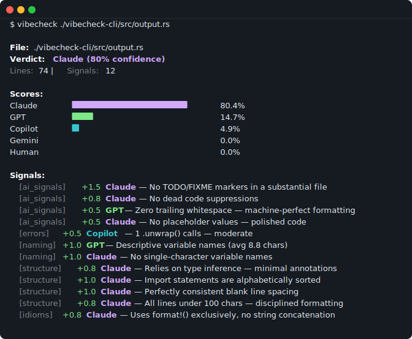

# vibecheck

```

  ██╗   ██╗██╗██████╗ ███████╗ ██████╗██╗  ██╗███████╗ ██████╗██╗  ██╗
  ██║   ██║██║██╔══██╗██╔════╝██╔════╝██║  ██║██╔════╝██╔════╝██║ ██╔╝
  ██║   ██║██║██████╔╝█████╗  ██║     ███████║█████╗  ██║     █████╔╝
  ╚██╗ ██╔╝██║██╔══██╗██╔══╝  ██║     ██╔══██║██╔══╝  ██║     ██╔═██╗
   ╚████╔╝ ██║██████╔╝███████╗╚██████╗██║  ██║███████╗╚██████╗██║  ██╗
    ╚═══╝  ╚═╝╚═════╝ ╚══════╝ ╚═════╝╚═╝  ╚═╝╚══════╝ ╚═════╝╚═╝  ╚═╝

         🔍 sniff out the AI slop 🤖
         ━━━━━━━━━━━━━━━━━━━━━━━━━

```

[](https://github.com/o-k-a-y/vibecheck/actions/workflows/vibecheck.yml)
[](https://github.com/o-k-a-y/vibecheck/blob/main/LICENSE)
[](https://www.rust-lang.org)
[](https://github.com/o-k-a-y/vibecheck)

> *"I don't always write Rust, but when I do, every function has a doc comment and zero `.unwrap()` calls."*
> *— The Most Interesting LLM in the World*

**vibecheck** detects AI-generated code and attributes it to a model family. It sniffs out the telltale "vibes" that different AI models leave in code — the suspiciously perfect formatting, the teaching-voice comments, the conspicuous absence of `TODO: fix this later`.



```
   The 5 stages of vibecheck grief:

   1. Denial     "I wrote this myself"
   2. Anger      "The heuristics are WRONG"
   3. Bargaining "Ok but I modified 2 lines"
   4. Depression  vibecheck src/my_code.rs
                  > Verdict: Claude (94%)
   5. Acceptance "...yeah that's fair"

   ───────────────────────────────────────

   Nobody:
   Absolutely nobody:
   Your AI-generated code:

      /// Processes the input data by applying the configured
      /// transformation pipeline and returning the validated result.
      pub fn process_and_validate_input_data(
          &self,
          input_data: &InputData,
      ) -> Result<ValidatedOutput, ProcessingError> {
```

## How It Works

vibecheck runs your source code through two layers of analysis:

**Layer 1 — Text-pattern analyzers** (all languages):

| Analyzer | What It Sniffs | Example Signal |
|----------|---------------|----------------|
| **Comment Style** | Density, teaching voice, doc comments | *"12 comments with teaching/explanatory voice"* |
| **AI Signals** | TODO absence, no dead code, eerie perfection | *"Every function has a doc comment — suspiciously thorough"* |
| **Error Handling** | unwrap vs expect vs ?, panic usage | *"Zero .unwrap() calls — careful error handling"* |
| **Naming** | Variable length, descriptiveness, single-char names | *"Very descriptive variable names (avg 14.2 chars)"* |
| **Code Structure** | Type annotations, import ordering, formatting | *"Import statements are alphabetically sorted"* |
| **Idiom Usage** | Iterator chains, builder patterns, Display impls | *"8 iterator chain usages — textbook-idiomatic Rust"* |

**Layer 2 — tree-sitter CST analyzers** (language-aware):

| Language | Signals |
|----------|---------|
| **Rust** | Cyclomatic complexity, doc comment coverage on pub fns, identifier entropy, nesting depth, import ordering |
| **Python** | Docstring coverage, type annotation coverage, f-string vs %-format ratio |
| **JavaScript** | Arrow function ratio, async/await vs `.then()` chaining, optional chaining density |
| **Go** | Godoc coverage on exported functions, goroutine count, `err != nil` check density |

Each signal has a **weight** (positive = evidence for, negative = evidence against) and points to a **model family**. The pipeline aggregates all signals into a probability distribution.

Results are stored in a **content-addressed cache** (redb, keyed by SHA-256 of file contents) so unchanged files are never re-analyzed.

## Installation

```bash
# Install the CLI
cargo install vibecheck-cli

# Add the library to your project
cargo add vibecheck-core
```

## Usage

### CLI

```bash
# Analyze a single file (pretty output with colors)
vibecheck src/main.rs

# Analyze a directory (supports .rs, .py, .js, .ts, .go)
vibecheck src/

# Plain text output
vibecheck src/lib.rs --format text

# JSON output (for piping to other tools)
vibecheck src/ --format json

# Enforce attribution in CI — exit 1 if any file isn't attributed to one of these families
vibecheck src/ --assert-family claude,gpt,copilot,gemini

# Assert human authorship specifically
vibecheck src/ --assert-family human

# Skip the cache (always re-analyze, useful for CI reproducibility)
vibecheck src/ --no-cache
```

`--assert-family` accepts a comma-separated list of `claude`, `gpt`, `copilot`, `gemini`, or `human`. If any analyzed file's primary attribution is **not** in the list, vibecheck prints a failure summary to stderr and exits with code `1`. This is the flag that makes vibecheck useful in CI.

### Example Output

Not every file is a slam dunk. `src/pipeline.rs` scores 72% — the two `.unwrap()` calls bleed a few points toward Copilot:

```
$ vibecheck src/pipeline.rs

File: src/pipeline.rs
Verdict: Claude (72% confidence)
Lines: 86 | Signals: 12

Scores:
  Claude     █████████████████████ 72.5%
  GPT        ██████ 22.9%
  Copilot    █ 4.6%
  Gemini     0.0%
  Human      0.0%

Signals:
  [ai_signals] +1.5 Claude — No TODO/FIXME markers in a substantial file
  [ai_signals] +0.8 Claude — No dead code suppressions
  [ai_signals] +0.5 GPT — Zero trailing whitespace — machine-perfect formatting
  [errors] +0.5 Copilot — 2 .unwrap() calls — moderate
  [naming] +1.0 Claude — No single-character variable names
  [idioms] +1.5 Claude — 6 iterator chain usages — textbook-idiomatic Rust
  [idioms] +1.0 GPT — 11 method chain continuation lines — builder pattern
  [structure] +1.0 Claude — Import statements are alphabetically sorted
  [structure] +0.8 Claude — All lines under 100 chars — disciplined formatting
  [rust_cst] +2.5 Claude — Low average cyclomatic complexity (1.2) — simple, linear functions
  [rust_cst] +1.5 Claude — Low average nesting depth (2.1) — flat, readable structure
  [rust_cst] +1.0 Claude — use declarations are alphabetically sorted
```

### The Ultimate Test: Self-Detection

vibecheck was written by an AI. Does it know?

```
$ vibecheck vibecheck-core/src/ --format text

vibecheck-core/src/report.rs          → Claude (96%)   # 👀
vibecheck-core/src/cache.rs           → Claude (96%)
vibecheck-core/src/language.rs        → Claude (93%)
vibecheck-core/src/analyzers/cst/python.rs → Claude (85%)
vibecheck-core/src/pipeline.rs        → Claude (74%)   # two .unwrap()s cost it
```

Every file in the codebase is correctly attributed to Claude. The confidence ranges from 74% to 96% depending on how "perfect" the individual file is.

```
$ vibecheck vibecheck-core/src/ --assert-family claude --no-cache

All files passed the vibe check.      # exits 0
```

```
  When the AI detector you wrote with AI detects itself as AI:

            ┌────────────────────────┐
            │                        │
            │   ◉_◉                  │
            │                        │
            │   ...well, well, well. │
            │                        │
            │   If it isn't the      │
            │   consequences of my   │
            │   own architecture.    │
            │                        │
            └────────────────────────┘

  "I'm in this photo and I don't like it"
            — this crate's source code, literally
```

### Library API

```rust
use std::path::Path;
use vibecheck_core::report::ModelFamily;

// Analyze a string
let report = vibecheck_core::analyze(source_code);
println!("Verdict: {} ({:.0}%)",
    report.attribution.primary,
    report.attribution.confidence * 100.0);

// Analyze a file (uses content-addressed cache automatically)
let report = vibecheck_core::analyze_file(Path::new("suspect.rs"))?;
if report.attribution.primary != ModelFamily::Human {
    println!("Caught one! This code was probably written by {}",
        report.attribution.primary);
}

// Bypass the cache
let report = vibecheck_core::analyze_file_no_cache(Path::new("suspect.rs"))?;
```

### GitHub Action / CI Integration

A ready-to-use workflow lives at `.github/workflows/vibecheck.yml`. It triggers on every pull request and exits `1` if any file's attribution isn't in the allowed list — blocking the PR automatically.

**Use case 1: enforce that all code is AI-generated** (vibecheck dogfoods this on itself)

```yaml
- name: Vibecheck source code
  run: cargo run --release -p vibecheck-cli -- vibecheck-core/src/ --format text --assert-family claude,gpt,copilot,gemini --no-cache
```

**Use case 2: enforce that all code is human-written** (block AI slop from landing)

```yaml
- name: No AI slop allowed
  run: vibecheck src/ --assert-family human
```

When a file fails, stderr shows exactly what was caught and why:

```
--- VIBECHECK FAILED ---
  src/new_feature.rs — detected as Claude (89%), expected one of: human
```

Exit code `1` fails the job and blocks the PR. Both use cases work the same way — `--assert-family` is just a comma-separated list of families you're willing to accept.

## Architecture

### Current (Phase 1) — Workspace + CST Engine

```
                    ┌─────────────────────────────────────┐
                    │          vibecheck-core              │
                    │                                     │
  source code ───►  │  SHA-256 → redb cache lookup        │
  (.rs/.py/etc.)    │         │ (hit: return cached)      │
                    │         ▼ (miss: analyze)           │
                    │  TextAnalyzers[]  CstAnalyzers[]    │
                    │   (6 pattern)    (tree-sitter)      │
                    │         └─────────┬──────────┘      │
                    │                Signals              │
                    │                   │                 │
                    │          Aggregate + Normalize      │
                    │                   │                 │
                    │               Report ──► cache.put  │
                    └───────────────────┼─────────────────┘
                                        │
                               vibecheck-cli
                           (--format, --assert-family,
                            --no-cache, walkdir)
```

### Target (v2) — Trend Tracking + ML

> **Not yet implemented** — planned for v0.2–v1.0

```
                    ┌─────────────────────────────────────┐
                    │          vibecheck-core              │
                    │                                     │
  source code ───►  │  tree-sitter CST (multi-language)   │
  (.rs/.py/etc.)    │         │                           │
                    │  CstAnalyzers[]  TextAnalyzers[]    │
                    │       └─────────┬───────────┘       │
                    │              Signals                │
                    │                 │                   │
                    │   ┌─────────────┴────────────────┐  │
                    │   │  Aggregate · Normalize · ML  │  │
                    │   └─────────────┬────────────────┘  │
                    │                 │                   │
                    │   ┌─────────────┴────────────┐      │
                    │   │  Report + SymbolReport   │      │
                    │   └─────────────┬────────────┘      │
                    └─────────────────┼───────────────────┘
                                      │
                      ┌───────────────┼──────────────────┐
                      │               │                  │
               ┌──────┴──────┐  ┌─────┴──────┐   ┌───────┴───────┐
               │vibecheck-cli│  │  external  │   │ Trend Store   │
               │             │  │  tools /   │   │ (SQLite/redb) │
               │ TUI browser │  │  importers │   │               │
               │ watch mode  │  │  (library) │   │ git history   │
               │ git history │  │            │   │ + live watch  │
               └─────────────┘  └────────────┘   └───────────────┘
```

**Crate split:**

| Crate | Contents | Who uses it |
|-------|----------|-------------|
| `vibecheck-core` | Analysis engine, CST analyzers, cache, corpus store | any tool that imports it |
| `vibecheck-cli` | CLI binary | end users |

`vibecheck-core` has no CLI dependencies — it is a clean library crate that any tool can import.

## Model Family Profiles

How vibecheck tells them apart:

- **Claude**: Thorough doc comments, teaching voice, zero `unwrap()`, textbook iterator chains, `format!()` over concatenation, sorted imports, suspiciously complete
- **GPT**: Explicit type annotations, builder patterns, method chaining, explanatory (but less pedagogical) comments
- **Copilot**: Works but cuts corners — moderate `unwrap()` usage, less documentation, pragmatic completion style
- **Gemini**: Currently limited signal set (future improvement area)
- **Human**: TODOs everywhere, `// HACK`, commented-out code, single-character variables, `panic!()` calls, string concatenation, chaotic formatting

## Feature Flags

| Crate | Feature | Default | What it enables |
|-------|---------|---------|-----------------|
| `vibecheck-core` | `corpus` | No | SQLite corpus + trend store (`rusqlite`) |
| `vibecheck-cli` | — | — | CLI binary; always has `clap`, `walkdir`, `colored`, `anyhow` |

### The `corpus` feature

The corpus store is separate from the content-addressed redb cache. They serve different purposes:

- **redb cache** (always on) — performance. If a file's SHA-256 hash hasn't changed, return the cached `Report` instantly without re-running any analyzers.
- **corpus store** (opt-in) — data collection. Every result is written to SQLite in two tables:
  - `corpus_entries` — one deduplicated row per unique file hash, recording its attribution and confidence.
  - `trend_entries` — a timestamped row on every analysis run (no deduplication). This lets you plot how a file's attribution drifts over time as you edit it or as the heuristics improve.

To enable the corpus store:

```bash
cargo add vibecheck-core --features corpus
```

### Planned: TUI Codebase Navigator

> **Not yet implemented** — planned for v0.2

An interactive terminal UI (`vibecheck tui <path>`) that lets you browse AI likelihood across an entire codebase — navigating like a file tree but seeing confidence scores and trend sparklines at every level:

```
vibecheck/                    [Claude 78%]  ▁▂▃▄▅▇  (30-day trend)
  src/                        [Claude 82%]  ▁▃▅▇█
    analyzers/                [Claude 75%]  ▁▂▃▄▅
      ai_signals.rs           [Claude 91%]  ▄▅▆▇█
        AiSignalsAnalyzer     [Claude 91%]
          Analyzer::analyze   [Claude 88%]  ▃▅▇
      code_structure.rs       [Claude 71%]  ▁▂▃▃▄
    pipeline.rs               [Claude 85%]  ▁▄▇▇█
      Pipeline::run           [Claude 88%]  ▂▄▆█
      Pipeline::aggregate     [Claude 95%]  ▅▇██
```

Confidence rolls up: symbol → file → directory (weighted by lines of code).

### Planned: Historical & Live Trend Tracking

> **Not yet implemented** — planned for v0.2

```bash
# Watch a file live — re-analyze on save, stream deltas
vibecheck watch src/

# Walk git history and build a trend
vibecheck history src/pipeline.rs --since 2025-01-01

# Both at once in the TUI
vibecheck tui src/ --watch
```

Historical mode replays git log. Watch mode appends as you code. Both write to the same trend store so you get a continuous picture from "when the repo started" to "right now".

## What's Coming

```
  THE GRAND PLAN (revised)
  ──────────────────────────────────────────────────────
  v0.1 - "It Works On My Machine"          ✓ shipped
  v0.2 - "Infrastructure That Doesn't Lie"   <- next
  v0.3 - "We Can Smell Python Too Now"
  v0.4 - "Your Codebase Has a Trend Problem"
  v1.0 - "Skynet But For Code Review"
  ──────────────────────────────────────────────────────
```

## Roadmap

### Phase 1 — Infrastructure ✅
- [x] **Crate split** — `vibecheck-core` (library) + `vibecheck-cli` (binary)
- [x] **Content-addressed cache** — SHA-256 per file; skip re-analysis of unchanged files (redb)
- [x] **tree-sitter CST analysis** — Rust (5 signals), Python (3 signals), JavaScript (3 signals), Go (3 signals)
- [x] **Corpus store** — SQLite-backed labeled dataset + trend log, feature-gated (`--features corpus`)
- [x] **Library API** — `vibecheck-core` is a clean library crate with no CLI dependencies
- [x] **JSON output** — pipe results to other tools
- [x] **GitHub Action** — run vibecheck in CI, fail PRs based on AI attribution (`--assert-family`)

### Phase 2 — Visible Product
- [ ] **Historical trend tracking** — `vibecheck history <path>` replays git log
- [ ] **Live watch mode** — `vibecheck watch <path>` re-analyzes on file saves
- [ ] **TUI navigator** — ratatui-based codebase browser with confidence bars + sparklines

### Phase 3 — Corpus Growth
- [ ] **Merkle hash tree** — incremental directory analysis; only re-analyze changed subtrees
- [ ] **Git repo scraper** — acquire labeled corpus from public repos via commit co-author metadata

### Phase 4 — Intelligence
- [ ] **ML classification** — `linfa`-based model trained on scraped corpus; replaces hand-tuned weights
- [ ] **Version detection** — distinguish Claude 3.5 vs Claude 4, GPT-3.5 vs GPT-4o (corpus permitting)
- [ ] **Plugin system** — WASM-based external analyzers
- [ ] **Benchmark suite** — accuracy metrics against known human/AI code datasets

### Already Shipped
- [x] **6 text-pattern analyzers** — comment style, AI signals, error handling, naming, code structure, idiom usage
- [x] **tree-sitter CST analyzers** — Rust (5), Python (3), JavaScript (3), Go (3)
- [x] **Content-addressed cache** — redb backend, SHA-256 keyed, instant on cache hit
- [x] **Corpus store** — accumulates labeled samples and per-file trend history in SQLite (`--features corpus`)
- [x] **GitHub Action** — run vibecheck in CI, fail PRs based on AI attribution (`--assert-family`)
- [x] **JSON output** — pipe results to other tools
- [x] **Library API** — `vibecheck-core` is a clean library crate with no CLI dependencies

## Limitations

```
  ┌─────────────────────────────────────────────────┐
  │                                                 │
  │  DISCLAIMER (legally required vibes disclosure) │
  │                                                 │
  │  vibecheck is a heuristic tool.                 │
  │  It detects VIBES, not PROOF.                   │
  │                                                 │
  │  A meticulous human might code like Claude.     │
  │  A sloppy prompt might produce messy AI.        │
  │                                                 │
  │  Do NOT use this to:                            │
  │    - accuse your coworker in a code review      │
  │    - settle bets on who wrote the bug           │
  │    - submit as evidence in a court of law       │
  │                                                 │
  │  DO use this to:                                │
  │    - win bets on who wrote the bug              │
  │    - roast your team's PR descriptions          │
  │    - feel seen when it detects your AI code     │
  │                                                 │
  │  (Also, this entire crate was written by an AI  │
  │   so we are absolutely not throwing stones.)    │
  │                                                 │
  └─────────────────────────────────────────────────┘
```

**Current limitations (v0.1):**
- **Heuristic-based** — no ML model; weights are hand-tuned, not learned from a corpus
- **Not adversarial-resistant** — deliberately obfuscated AI code will fool it
- **Model family overlap** — GPT and Claude share many patterns; attribution between them is fuzzy
- **File-level only** — can't detect mixed human/AI authorship within a single file; symbol-level coming in a future release
- **No trend tracking** — point-in-time only; historical and live trend tracking coming in a future release

## Contributing

Contributions welcome! Some high-impact areas:

1. **More signals** — if you notice a pattern that screams "AI wrote this", open a PR
2. **Weight tuning** — help calibrate signal weights against real-world code
3. **More CST signals** — extend the existing JS/Go/Rust/Python CST analyzers or add a new language (implement `CstAnalyzer` and register in `default_cst_analyzers()`)
4. **Test corpus** — curate labeled examples of human vs AI code for training and benchmarking
5. **New text analyzers** — implement the `Analyzer` trait (`analyze(&str) -> Vec<Signal>`) and register in `default_analyzers()`

## License

MIT

---

```
  Made with massive vibes by an AI that is fully aware
  of the irony of writing a tool to detect itself.

  ┌──────────────────────────────────────────────────┐
  │  $ vibecheck vibecheck-core                      │
  │                                                  │
  │  Verdict: Claude (81%)                           │
  │                                                  │
  │  Signals:                                        │
  │    [ai_signals] Zero TODOs, alphabetized         │
  │    imports, and every function has a doc         │
  │    comment. This is either a very disciplined    │
  │    human or — and I cannot stress this enough    │
  │    — a chatbot.                                  │
  │                                                  │
  │    Source: I am literally that chatbot.          │
  │                                                  │
  └──────────────────────────────────────────────────┘
```
